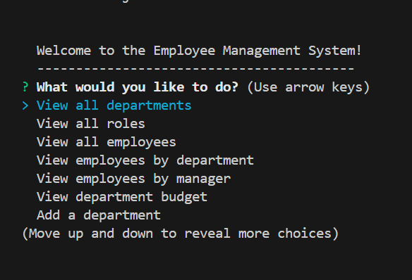

# Employee Tracker


## Description

This project is an Employee Management System that allows users to view and manage the departments, roles, and employees in a company. It provides a command-line interface to interact with the database and perform various operations such as adding, modifying, and deleting records.



## Table of Contents
- [Installation](#installation)
- [Usage](#usage)
- [License](#license)
- [Contributing](#contributing)
- [Questions](#questions)
- [Video](#video)


## Installation
1. Clone the repository:
    ```sh
    git clone https://github.com/Pink727/Employee_Tracker.git
    ```
2. Navigate to the project directory:
    ```sh
    cd Employee_Tracker
    ```
3. Install the dependencies:
    ```sh
    npm install
    ```
4. Set up the database:
    - Create a `.env` file in the root directory and add your database credentials:
        ```
        DB_USER=your_db_user
        DB_NAME=your_db_name
        DB_PASSWORD=your_db_password
        ```
    - Run the schema and seed files to set up the database structure and initial data:
        ```sh
        psql -U your_db_user -d your_db_name -f db/schema.sql
        psql -U your_db_user -d your_db_name -f db/seeds.sql
        ```

## Usage
To start the application, run the following command:
```sh
npm start
```
Follow the prompts in the command-line interface to perform various operations.

## Video
[Watch the video demonstration](https://youtu.be/SPvWyl2frV4)

## License
This project is licensed under the [MIT License](https://opensource.org/license/mit).

## Contributing
Contributions are welcome! Please open an issue or submit a pull request for any improvements or bug fixes.


## Questions
For any questions, please contact me with the information below:

GitHub: [Pink727](https://github.com/pink727)

Email: doc72789@gmail.com

© 2024 Pink727. All Rights Reserved.

